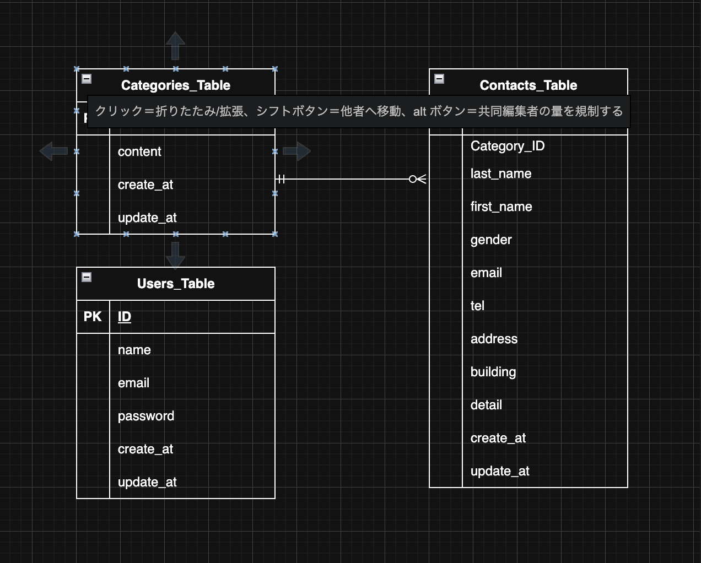

# ontact

# 環境構築

## Dockerビルド

 ・ git clone <git@github.com>:haruki-saitou/first-contact.git  
 ・ docker-compose up -d --build

## Laravel環境構築

 ・ docker-compose exec php bash  
 ・ composer install  
 ・ cp .env.exemple. .env , 環境変数を適宣変更  
 ・ php artisan key:generate  
 ・ php artisan migrate  
 ・ php artisan db:seed  

## 開発環境

 ・ ユーザー登録 : <http://localhost/register>  
 ・ ログイン : <http://localhost/login>  
 ・ お問合せ画面 : <http://localhost/>  
 ・ お問合せ内容確認 : <http://localhost/confirm>  
 ・ 送信完了画面 : <http://localhost/thanks>  
 ・ 管理画面 : <http://localhost/admin>  
 ・ phpMyAdmin : <http://localhost:8080/>  

## 使用技術(実行環境)

・ PHP 8.1.33  
・ MySQL 8.0  
・ nginx 1.21.1  
・ laravel : 8.83.8  

## 機能一覧
管理者機能: お問い合わせ一覧の閲覧、検索、詳細表示、削除、CSVエクスポート  
ユーザー認証機能（ログイン、ログアウト） 

## ER図

  

